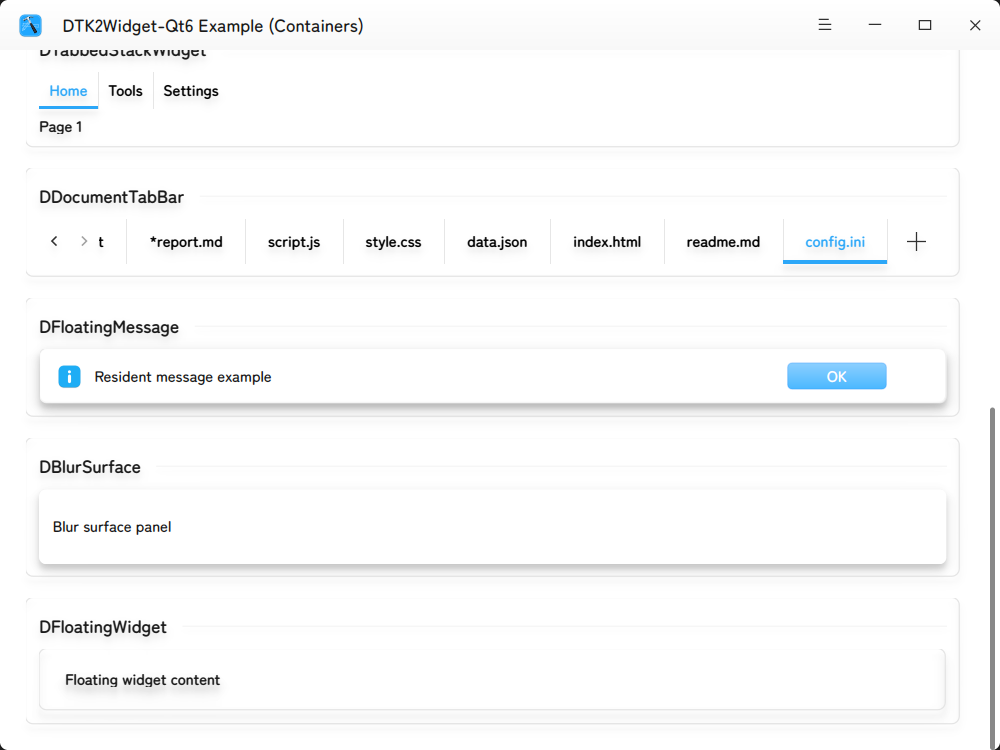

[[简体中文](./README.md) | English]

<a id="readme-top"></a>


<!-- PROJECT LOGO -->
<br />
<div align="center">
  <h3 align="center">DTK2Widget-Qt6</h3>

  <p align="center">
    <sup>(EXPERIMENTAL)</sup>A port to Qt6 for DTK2 Widgets<br />
    <a href="https://gitee.com/GXDE-OS/dtk2widget-qt6/wikis"><strong>Read WIKI »</strong></a>
    <br />
    <br />
    <a href="https://gitee.com/GXDE-OS/gxde-qt6-integration">Corresponding Qt Intergration</a>
    &middot;
    <a href="https://gitee.com/GXDE-OS/dtk2widget-qt6/issues">Report a Problem</a>
    &middot;
    <a href="https://gitee.com/GXDE-OS/dtk2widget-qt6/issues">Request New Widgets</a>
  </p>
</div>

> **Note**: This is NOT the official repository of Deepin!!

<!-- TABLE OF CONTENTS -->
<details>
  <summary>Table of Contents</summary>
  <ol>
    <li>
      <a href="#about-this-project">About This Project</a>
      <ul>
        <li><a href="#dependencies">Dependencies</a></li>
      </ul>
    </li>
    <li>
      <a href="#getting-started">Getting Started</a>
      <ul>
        <li><a href="#installing-dependencies">Installing Dependencies</a></li>
        <li><a href="#compiling-from-source">Compiling From Source</a></li>
        <li><a href="#packaging">Packaging</a></li>
      </ul>
    </li>
    <li><a href="#usage">Usage</a></li>
    <li><a href="#roadmap">Roadmap</a></li>
    <li><a href="#contributing">Contributing</a></li>
    <li><a href="#license">License</a></li>
    <li><a href="#contact">Contact</a></li>
    <li><a href="#original-readme">Original README</a></li>
    <li><a href="#acknowledgements">Acknowledgements</a></li>
  </ol>
</details>


<!-- ABOUT THE PROJECT -->
## About This Project



Love the apperance of DTK2 but prefer Qt6? We got you!

This repository is the port of Deepin's classical DTK2 Widget to Qt6, we translated the API difference between Qt5 and Qt6 and developed the corresponding [GXDE-Qt6-Integration](https://gitee.com/GXDE-OS/gxde-qt6-integration) so that you may use Qt6 and DTK2 Widgets at the same time.

<p align="right">(<a href="#readme-top">Back to top</a>)</p>


### Dependencies
* For building the `.deb` package: 
  * debhelper <sub>(>= 9)</sub>
  * pkg-config
* Qt6: <sub>(Qt 6.8.2 is preferred)</sub>
  * qt6-base-dev
  * qt6-base-private-dev
  * qt6-tools-dev-tools
  * qt6-multimedia-dev
  * qt6-svg-dev
  * qt6-l10n-tools
  * qt6-scxml-dev
* DTK: 
  * libdtk6core-dev
  * libdtk6log-dev
  * libgsettings-qt6-dev
* X11/System: 
  * libudev-dev
  * libxext-dev
  * x11proto-xext-dev
  * libxcb-util-dev
  * libxrender-dev
  * libxi-dev
  * libstartup-notification0-dev
  * libmtdev-dev
* Graphical: 
  * libegl1-mesa-dev
  * libfontconfig1-dev
  * libfreetype6-dev
  * libglib2.0-dev
  * librsvg2-dev
* Runtime: 
  * [gxde-qt6integration_6.0.1-1](https://gitee.com/GXDE-OS/gxde-qt6-integration)

<p align="right">(<a href="#readme-top">Back to top</a>)</p>


<!-- GETTING STARTED -->
## Getting Started
This project is built with `qmake6` and then packed with Debian's standard `debuild` process.

The following instruction is based on GXDE 25.3.

### Installing Dependencies

1. Installing the packaging tools: 
   ```bash
   sudo apt update
   sudo apt install build-essential devscripts debhelper pkg-config git
   ```

2. Install devel packages<sup>(Be sure to read the *[Dependencies](#dependencies)* part)</sup>：
   ```bash
   sudo apt install \
       qt6-base-dev qt6-base-private-dev qt6-tools-dev-tools \
       qt6-multimedia-dev qt6-svg-dev qt6-l10n-tools qt6-scxml-dev \
       libdtk6core-dev libdtk6log-dev libgsettings-qt6-dev \
       libudev-dev libxext-dev x11proto-xext-dev libxcb-util-dev \
       libxrender-dev libxi-dev libstartup-notification0-dev libmtdev-dev \
       libegl1-mesa-dev libfontconfig1-dev libfreetype6-dev \
       libglib2.0-dev librsvg2-dev
   ```

   > **Note**: After entering the project directory, you may use `sudo apt build-dep .` to let apt get and install all depencies according to `debian/control`.

### Compiling From Source

If you only want the library but not the `deb` package, then do the following: 

1. Clone this repository: 
   ```bash
   git clone https://gitee.com/GXDE-OS/dtk2widget-qt6.git
   cd dtk2widget-qt6
   ```

2. Use `qmake6` to configre the project:
   ```bash
   mkdir build-qt6
   cd build-qt6
   qmake6 ../dtkwidget.pro PREFIX=/usr LIB_INSTALL_DIR=/usr/lib/$(dpkg-architecture -qDEB_HOST_MULTIARCH)
   ```

3. Compile project: 
   ```bash
   make -j$(nproc)
   ```

4. Install to system (Optional, this will be write to path under `/usr`): 
   ```bash
   sudo make install
   ```

### Packaging

This would be recommended if you are using debian-based distros.

1. Clone the repository and enter the project root: 
   ```bash
   git clone https://gitee.com/GXDE-OS/dtk2widget-qt6.git
   cd dtk2widget-qt6
   ```

> **Note**: You have to be at the parent directory of the `debian/` folder.


2. Build the package: 
   ```bash
   debuild -us -uc -b

3. If packaging scceed, the generated `.deb` file could be found in the **parent directory**, consisting the following packages: 
   * **`libdtk2widget6_<VERSION>_<ARCHITECTRE>.deb`**: The runtime library.
   * **`libdtk2widget6-dev_<VERSION>_<ARCHITECTRE>.deb`**: Devel package.

4. To do the cleanup: 
   ```bash
   cd dtk2widget-qt6
   debuild clean   # Or: fakeroot debian/rules clean
   ```

<p align="right">(<a href="#readme-top">Back to top</a>)</p>


<!-- USAGE EXAMPLES -->
## Usage

To use this library, please also install the depended runtime [gxde-qt6integration](https://gitee.com/GXDE-OS/gxde-qt6-integration).

Currently we are making a new example project.

_For documentation, please go to our [WIKI](https://gitee.com/GXDE-OS/dtk2widget-qt6/wikis)_

<p align="right">(<a href="#readme-top">Back to top</a>)</p>


<!-- ROADMAP -->
## Roadmap

**Related issue**: [(Gitee) #IJJXNG](https://gitee.com/GXDE-OS/dtk2widget/issues/IJJXNG)

- [x] Fix the crashing caused by depending on Qt5 D-Bus.
- [x] Translate the API difference in the source between Qt5 and Qt6.
- [x] Develop the new Qt integration.
- [ ] Add documentations.
- [ ] Add new example project.

<p align="right">(<a href="#readme-top">Back to top</a>)</p>


<!-- CONTRIBUTING -->
## Contributing

If you would like to contribute to this project, you're welcome to fork this repository and open a new pull request.

If you want to request new widgets, please open a new Issue.

### Contributors of This Project

<a href="https://github.com/GXDE-OS/dtk2widget-qt6/graphs/contributors">
  
</a>

<p align="right">(<a href="#readme-top">Back to top</a>)</p>


<!-- LICENSE -->
## License

This project is licensed under GNU LESSER GENERAL PUBLIC LICENSE Version 3. You may find the license [here](./LICENSE).

<p align="right">(<a href="#readme-top">Back to top</a>)</p>


<!-- CONTACT -->
## Contact

The recommended way to contact us is to fire up a new Issue and describe the problem that you encountered.

<p align="right">(<a href="#readme-top">Back to top</a>)</p>


<!-- ORIGINAL README -->
## Original README

This project is a fork of Deepin's DTK2, and the original README is available [here](./README.original.md).

<p align="right">(<a href="#readme-top">Back to Top</a>)</p>


<!-- ACKNOWLEDGMENTS -->
## Acknowledgements

Thanks to all the third party libraries we used, Best-README-Template, and YOU.

<p align="right">(<a href="#readme-top">Back to top</a>)</p>
